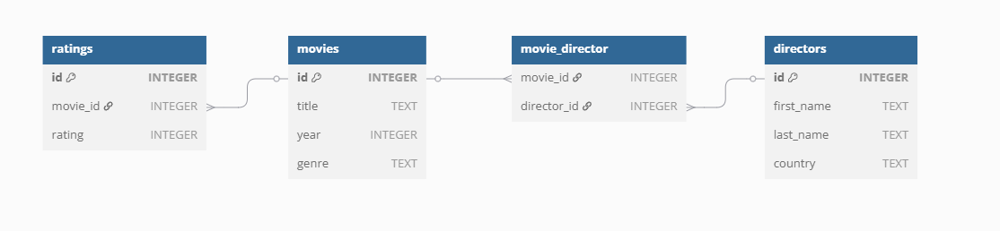
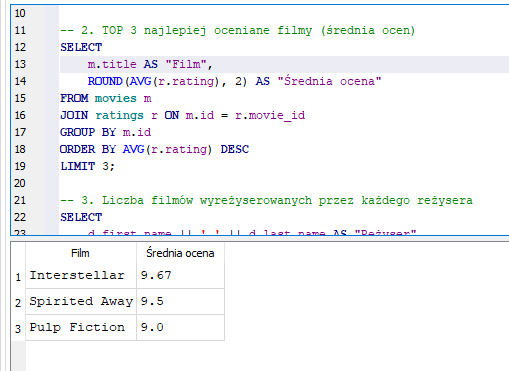

# 🗃️ SQL Mini Projekt – Baza Filmowa

## 🖼 Podgląd bazy danych

Powyżej: struktura relacyjna bazy danych – filmy, reżyserzy i oceny.

Powyżej: wynik zapytania `SELECT` z JOINami i średnią oceną.

## 🔍 Opis
Edukacyjny projekt SQL przedstawiający relacyjną bazę danych o filmach, reżyserach i ocenach użytkowników. Projekt stworzony w celach nauki SQL i dokumentowania praktyki do portfolio.

## 🧱 Struktura bazy danych
Baza składa się z 4 tabel:

- `movies` – lista filmów (tytuł, rok, gatunek)
- `directors` – reżyserzy (imię, nazwisko, kraj)
- `movie_director` – relacja wiele-do-wielu film ↔ reżyser
- `ratings` – oceny użytkowników (1–10)

## 📄 Zawartość projektu

| Plik             | Opis |
|------------------|------|
| `schema.sql`      | definicje tabel (`CREATE TABLE`) |
| `schema.dbml`     | struktura bazy danych w formacie DBML (do użycia np. w dbdiagram.io) |
| `insert_data.sql` | dane testowe (`INSERT INTO`) |
| `queries.sql`     | zapytania SQL (`SELECT`, `JOIN`, `GROUP BY`, `HAVING`, `ORDER BY`) |
| `diagram.png`     | opcjonalnie: diagram relacji między tabelami |
| `README.md`       | ten opis projektu |

## 🧪 Przykładowe zapytania
- Lista filmów z reżyserami
- TOP 3 najlepiej oceniane filmy
- Średnia ocena filmów wg gatunku
- Filmy z oceną > 8 wydane po 2010 roku
- Liczba filmów na reżysera
- Filmy wyreżyserowane przez Nolana

## 🛠 Technologie
- SQLite 3
- DB Browser for SQLite
- SQL (standardowy dialekt)

## 👨‍💻 Autor
Michał Gągorowski  
📍 Sosnowiec, Polska  
🎓 Student informatyki

---

#SQL #SQLite #DatabaseProject #GitHubPortfolio #Mychal5on
